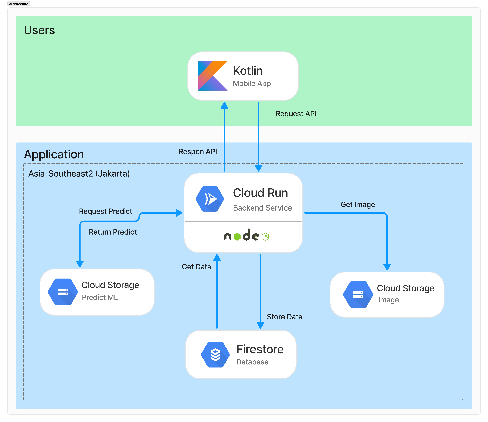

<h1 align="center">Exotiscan Backend Documentation</h1>
Welcome to the Exotiscan backend documentation! 🚀 Here, you will find everything you need to know about our REST API built with Nodejs framework. The documentation includes details about endpoints, as well as request and response structures that will make it easier for you to integrate and use our application.

Enjoy your exploration, and may you find it useful! 🎉

---

## Architecture

  

---

## Tech Stack

- Nodejs 18
  - hapi v21.3.0
  - tensorflow/tfjs-node v4.19.0
  - dotenv v16.4.7
  - google-cloud/firestore v7.10.0
- GCP
  - cloud storage
  - firestore
  - cloud run

## <h2 align="center">Exotiscan - Rest API Documentation</h2>

Postman Docs REST API: https://documenter.getpostman.com/view/36379704/2sAYHxm3LG

## Base URL

https://exotiscan-api-294736062649.asia-southeast2.run.app

---
